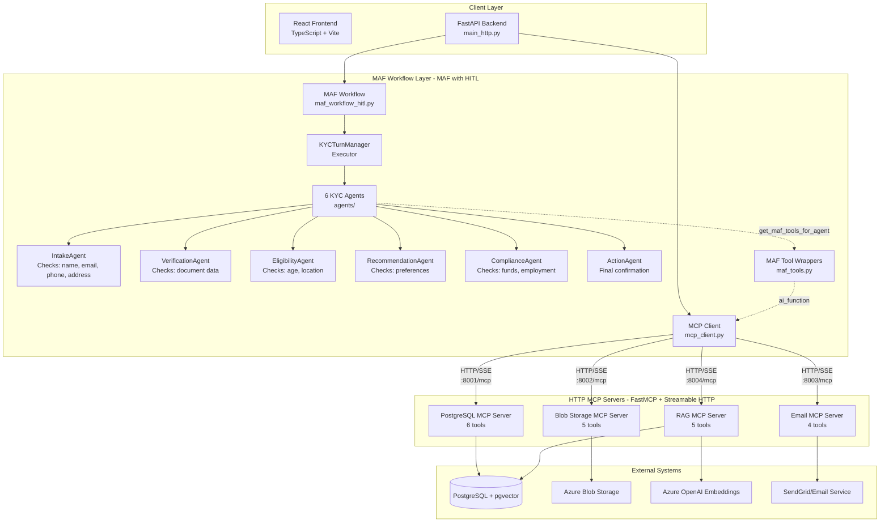

# Azure AI Foundry KYC Orchestrator with Microsoft Agent Framework

A comprehensive KYC (Know Your Customer) orchestrator using **Microsoft Agent Framework (MAF)** with **Human-in-the-Loop (HITL)** pattern and Model Context Protocol (MCP) for agentic systems capable of autonomously accessing external data, retrieving documents, checking compliance policies, and notifying customers.

## 🎯 Overview

This system implements a sophisticated KYC workflow using Microsoft Agent Framework's Human-in-the-Loop pattern. Agents autonomously check for required data and naturally pause the workflow when information is missing, creating an intuitive conversational experience.

**Architecture**: MAF with HITL + HTTP MCP Servers
- **Workflow**: `maf_workflow_hitl.py` - Sequential workflow with KYCTurnManager (Executor)
- **Agents**: `maf_agents_simple.py` - 6 agents that check data and request missing information
- **Tools**: `maf_tools.py` - MCP tools wrapped for MAF with @ai_function
- **Pattern**: Agents use `ctx.request_info()` to pause workflow when data is missing

**Key Benefits**:
- **Natural Conversations**: Agents ask for missing data conversationally
- **Event-Driven**: RequestInfoEvent and WorkflowOutputEvent enable reactive API
- **Data Tracking**: Customer data accumulates via `ctx.yield_output()`
- **True HITL**: Workflow pauses and resumes based on user responses

## ⚡ Quick Start

**Prerequisites**: Make sure you have all environment variables set in `.env` (see Environment Variables section below)

```bash
# 1. Install dependencies
pip install -r requirements.txt

# 2. Configure Azure OpenAI
export AZURE_OPENAI_ENDPOINT="https://your-endpoint.openai.azure.com/"
export AZURE_OPENAI_API_KEY="your-key"
export AZURE_OPENAI_DEPLOYMENT_NAME="gpt-4o"

# 3. Start all 4 MCP servers (REQUIRED FIRST!)
./start_all_mcp_servers.sh

# 4. Verify servers are running
curl http://127.0.0.1:8001/health  # Should return {"status":"ok"}

# 5. Start main application (MAF with HITL)
uvicorn main_http:app --reload --port 8000

# 6. (Optional) Start frontend
cd frontend && npm install && npm run dev
```

## 🚀 Features

### Workflow & Agents
- **Microsoft Agent Framework (MAF)**: Modern agent orchestration with HITL pattern
- **Human-in-the-Loop**: Agents naturally pause workflow when data is missing
- **6 Specialized Agents**: Intake → Verification → Eligibility → Recommendation → Compliance → Action
- **Event-Driven API**: RequestInfoEvent and WorkflowOutputEvent for reactive responses
- **Customer Data Tracking**: Accumulated via ctx.yield_output() from agents

### MCP Integration
- **HTTP MCP Architecture**: Independent, scalable MCP servers (ports 8001-8004)
- **20 MCP Tools**: Across 4 specialized servers (PostgreSQL, Blob, Email, RAG)
- **Agentic Tool Calling**: Tools wrapped with @ai_function for MAF agents

### User Experience
- **Real-time Chat Interface**: Interactive chat system for customer support
- **Step-by-Step Progress**: Visual workflow tracking with real-time updates
- **React Frontend**: Modern UI with TypeScript and Material-UI

### Reliability & Monitoring
- **Production-Ready Resilience**: Circuit breaker pattern, health monitoring, distributed tracing
- **Error Handling**: Graceful degradation with detailed error messages
- **OpenTelemetry**: Full distributed tracing for debugging and performance analysis

## 🏗️ Architecture



**Key Architecture Features:**
- **MAF HITL Pattern**: Workflow pauses when agents need data via `ctx.request_info()`
- **Event-Driven**: RequestInfoEvent and WorkflowOutputEvent drive API responses
- **KYCTurnManager**: Executor orchestrates agent transitions and data accumulation
- **HTTP-based MCP**: Servers run as independent HTTP services using FastMCP
- **Streamable HTTP Protocol**: Uses MCP's official protocol with SSE for tool responses
- **Port-based Isolation**: Each server on dedicated port (8001-8004)
- **Tool Wrapping**: MCP tools wrapped with @ai_function for MAF compatibility
- **Health Monitoring**: Each server exposes `/health` endpoint for monitoring

## Prerequisites

- Python 3.8+
- Node.js 16+
- PostgreSQL 14+ with pgvector extension
- Azure OpenAI service account
- Azure Blob Storage account
- SendGrid account (for email notifications)

## Installation

### Backend Setup

1. **Clone and navigate to the project**:
   ```bash
   cd azurefoundrymicrosoftagents
   ```

2. **Create virtual environment**:
   ```bash
   python3 -m venv myvenv
   source myvenv/bin/activate  # On Windows: venv\Scripts\activate
   ```

3. **Install dependencies**:
   ```bash
   pip install -r requirements.txt
   
   # Key dependencies include:
   # - fastapi, uvicorn: Web framework
   # - agent-framework: Microsoft Agent Framework orchestration
   # - mcp, fastmcp: MCP client/server framework
   # - aiobreaker: Circuit breaker for resilience
   # - opentelemetry-*: Distributed tracing
   ```

4. **Configure environment variables**:
   Create a `.env` file with your Azure credentials and service endpoints:
   ```env
   # PostgreSQL
   POSTGRES_HOST=localhost
   POSTGRES_PORT=5432
   POSTGRES_DB=kyc_crm
   POSTGRES_USER=postgres
   POSTGRES_PASSWORD=your_password
   
   # Azure OpenAI (for agents and embeddings)
   AZURE_OPENAI_ENDPOINT=https://your-resource-name.openai.azure.com/
   AZURE_OPENAI_API_KEY=your-api-key
   AZURE_OPENAI_DEPLOYMENT=gpt-4o-mini
   AZURE_OPENAI_EMBEDDING_DEPLOYMENT=text-embedding-ada-002
   
   # Azure Blob Storage
   AZURE_STORAGE_CONNECTION_STRING=your_connection_string
   AZURE_BLOB_CONTAINER=kyc-documents
   
   # SendGrid Email
   SENDGRID_API_KEY=your_sendgrid_key
   EMAIL_FROM=verified-sender@example.com
   
   # MCP Server URLs (default)
   MCP_POSTGRES_URL=http://127.0.0.1:8001/mcp
   MCP_BLOB_URL=http://127.0.0.1:8002/mcp
   MCP_EMAIL_URL=http://127.0.0.1:8003/mcp
   MCP_RAG_URL=http://127.0.0.1:8004/mcp
   ```

5. **Set up database**:
   ```bash
   # Create database and load schema
   psql -U postgres -c "CREATE DATABASE kyc_crm;"
   psql -U postgres -d kyc_crm -f datamodel/salesforce_core_schema.sql
   psql -U postgres -d kyc_crm -f datamodel/kyc_extensions_schema.sql
   
   # Seed test data
   python seed_crm_data.py
   ```

6. **Start MCP servers** (required before main app):
   ```bash
   ./start_all_mcp_servers.sh
   
   # Or start individually:
   uvicorn mcp_http_servers.postgres_http_server:app --port 8001 &
   uvicorn mcp_http_servers.blob_http_server:app --port 8002 &
   uvicorn mcp_http_servers.email_http_server:app --port 8003 &
   uvicorn mcp_http_servers.rag_http_server:app --port 8004 &
   ```

7. **Verify MCP servers are running**:
   ```bash
   curl http://127.0.0.1:8001/health
   curl http://127.0.0.1:8002/health
   curl http://127.0.0.1:8003/health
   curl http://127.0.0.1:8004/health
   ```

8. **Start the main application**:
   ```bash
   uvicorn main_http:app --reload --port 8000
   ```
   The API will be available at `http://localhost:8000`

### Frontend Setup

1. **Navigate to frontend directory**:
   ```bash
   cd frontend
   ```

2. **Install dependencies**:
   ```bash
   npm install
   ```

3. **Start the development server**:
   ```bash
   npm run dev
   ```
   The frontend will be available at `http://localhost:5173`

## Usage

1. **Start MCP servers** (in separate terminal or background):
   ```bash
   ./start_all_mcp_servers.sh
   ```

2. **Start main application** (port 8000):
   ```bash
   uvicorn main_http:app --reload --port 8000
   ```

3. **Start frontend** (port 5173):
   ```bash
   cd frontend && npm run dev
   ```

4. **Open the application** at `http://localhost:5173`

5. **Test the system**:
   ```bash
   # Verify MCP tool loading
   curl http://localhost:8000/mcp/tools
   
   # Start a KYC session
   curl -X POST http://localhost:8000/chat \
     -H "Content-Type: application/json" \
     -d '{"message": "I need home insurance", "session_id": "test-123"}'
   
   # Check session state
   curl http://localhost:8000/session/test-123
   ```

6. **Upload policy documents** (for RAG/compliance):
   ```bash
   curl -X POST http://localhost:8000/rag/upload \
     -F "file=@policy.pdf" \
     -F "category=underwriting"
   ```

## API Endpoints

### Core Endpoints
- `GET /` - Service info and architecture details
- `GET /health` - Detailed health check (includes MCP client status)
- `POST /chat` - Send chat message and process with agents
- `GET /sessions` - List all active sessions
- `GET /session/{session_id}` - Get session details
- `DELETE /session/{session_id}` - Delete a session

### MCP Endpoints
- `GET /mcp/tools` - List all 20 available MCP tools
- `GET /mcp/servers` - List MCP server configurations
- `GET /mcp/health` - Health status for all MCP servers (per-server monitoring)

### Telemetry Endpoints
- `GET /telemetry/recent` - Recent telemetry events (optional `session_id`)
- `GET /telemetry/session/{session_id}` - All telemetry for a session
- `GET /telemetry/stream/{session_id}` - Server-Sent Events stream of telemetry
- `GET /telemetry/stats/{session_id}` - Aggregated stats (agents, tools, tokens)

## MCP Servers

### 1. PostgreSQL MCP Server (Port 8001)
**Purpose**: Access customer CRM data for returning customers

**Tools**:
- `get_customer_by_email` - Lookup contact + account by email
- `get_customer_history` - Get orders, quotes, invoices
- `get_previous_kyc_sessions` - List past KYC sessions
- `save_kyc_session_state` - Persist session state
- `load_kyc_session_state` - Restore session from checkpoint
- `delete_kyc_session` - Delete a session

### 2. Blob Storage MCP Server (Port 8002)
**Purpose**: Store and retrieve customer documents

**Tools**:
- `list_customer_documents` - List all docs for a customer
- `get_document_url` - Get SAS URL for download
- `upload_document` - Store new document
- `get_document_metadata` - Get doc metadata
- `delete_document` - Delete a document

### 3. Email MCP Server (Port 8003)
**Purpose**: Send KYC outcome notifications

**Tools**:
- `send_kyc_approved_email` - Send approval notification
- `send_kyc_pending_email` - Send pending notification
- `send_kyc_rejected_email` - Send rejection notification
- `send_follow_up_email` - Request additional documents

### 4. RAG MCP Server (Port 8004)
**Purpose**: Query compliance policies with vector search

**Tools**:
- `search_policies` - Semantic search over policies
- `get_policy_requirements` - Get requirements for product
- `check_compliance` - Verify customer meets requirements
- `list_policy_categories` - List policy categories
- `delete_policy_document` - Delete policy chunks

## Agent Tool Bindings

| Agent | MCP Tools |
|-------|-----------|
| **IntakeAgent** | `get_customer_by_email`, `get_customer_history` |
| **VerificationAgent** | `list_customer_documents`, `get_document_url` |
| **EligibilityAgent** | `get_customer_history`, `search_policies` |
| **RecommendationAgent** | `get_customer_history`, `search_policies` |
| **ComplianceAgent** | `search_policies`, `check_compliance`, `get_policy_requirements` |
| **ActionAgent** | `send_kyc_approved_email`, `send_kyc_pending_email`, `save_kyc_session_state` |

## Testing

### Automated Tests

```bash
# Activate environment and run full suite
source myenv/bin/activate
pytest -v

# Run specific tests (examples)
pytest -v test_agent_tool_calls.py      # Validates agent tool calls
pytest -v test_hitl_workflow.py         # Human-in-the-loop workflow behavior
pytest -v test_http_mcp_tools.py        # HTTP MCP tool integration

# Standalone checks
python test_tool_binding.py             # LLM tool call verification
```

### Connection Testing

Verify external service connectivity before running the system:

```bash
# Examples (run as needed):
pytest -v tests/test_azure_openai_connection.py   # Azure OpenAI connectivity
pytest -v tests/test_postgresql_connection.py     # PostgreSQL connectivity
pytest -v tests/test_azure_blob_connection.py     # Azure Blob Storage connectivity
pytest -v tests/test_sendgrid_connection.py       # SendGrid email connectivity
```

## Configuration

### Environment Variables (Complete List)

```env
# PostgreSQL
POSTGRES_HOST=localhost
POSTGRES_PORT=5432
POSTGRES_DB=kyc_crm
POSTGRES_USER=postgres
POSTGRES_PASSWORD=secret

# MCP Server Ports (HTTP endpoints)
MCP_POSTGRES_URL=http://127.0.0.1:8001/mcp
MCP_BLOB_URL=http://127.0.0.1:8002/mcp
MCP_EMAIL_URL=http://127.0.0.1:8003/mcp
MCP_RAG_URL=http://127.0.0.1:8004/mcp

# Azure Blob Storage
AZURE_STORAGE_CONNECTION_STRING=DefaultEndpointsProtocol=https;AccountName=...
AZURE_BLOB_CONTAINER=kyc-documents

# Azure OpenAI (for agents and embeddings)
AZURE_OPENAI_ENDPOINT=https://your-resource.openai.azure.com/
AZURE_OPENAI_API_KEY=your-key
AZURE_OPENAI_DEPLOYMENT=gpt-4o-mini
AZURE_OPENAI_EMBEDDING_DEPLOYMENT=text-embedding-ada-002

# Email (SendGrid)
SENDGRID_API_KEY=SG.xxxxx
EMAIL_FROM=verified-sender@example.com  # Must be verified in SendGrid

# OpenTelemetry (optional)
OTEL_EXPORTER_OTLP_ENDPOINT=http://localhost:4317
ENV=development  # or production
LOG_LEVEL=INFO
```

> [!IMPORTANT]
> For SendGrid, `EMAIL_FROM` must be a **verified sender** in your SendGrid account.
> For Azure Blob Storage, ensure **"Allow storage account key access"** is enabled.

### Frontend Configuration
- `VITE_API_BASE_URL`: Backend API URL (default: http://localhost:8000)

## Development

### Backend Development
```bash
# Install development dependencies
pip install -r requirements.txt

# Start with auto-reload
uvicorn main_http:app --reload --host 0.0.0.0 --port 8000

# Run tests with coverage
pytest --cov=. --cov-report=html
```

### Frontend Development
```bash
cd frontend

# Start development server with hot reload
npm run dev

# Build for production
npm run build

# Preview production build
npm run preview
```

### Adding New MCP Tools

1. **Add tool to MCP server** (`mcp_http_servers/<server>_http_server.py`):
   ```python
   @mcp.tool()
   async def my_new_tool(param: str) -> dict:
       """Tool description for LLM."""
       # Implementation
       return {"result": "..."}
   ```

2. **Update agent's available_tools** (`agents/<agent>.py`):
   ```python
   @property
   def available_tools(self):
       return [
           "server__existing_tool",
           "server__my_new_tool"  # Add here
       ]
   ```

3. **Restart MCP server** and test:
   ```bash
   # Restart specific server
   pkill -f "postgres_http_server"
   uvicorn mcp_http_servers.postgres_http_server:app --port 8001 &
   
   # Verify tool appears
   curl http://localhost:8000/mcp/tools | grep my_new_tool
   ```

## Troubleshooting

### MCP Servers Not Running

**Issue**: `Connection refused` or `MCP client not initialized`

**Solution**:
```bash
# Check all servers
curl http://127.0.0.1:8001/health
curl http://127.0.0.1:8002/health
curl http://127.0.0.1:8003/health
curl http://127.0.0.1:8004/health

# Restart all
./start_all_mcp_servers.sh

# Or individually
uvicorn mcp_http_servers.postgres_http_server:app --port 8001 &
# ... etc
```

### Agents Not Calling Tools

**This is expected behavior!** The LLM only calls tools when it needs external data. The agent is smart enough to make decisions based on conversation context.

**To verify tool calling works**:
```bash
python test_tool_binding.py
# Expected: ✅ SUCCESS: LLM is requesting tool calls!
```

### Port Conflicts

**Issue**: `Address already in use`

**Solution**:
```bash
# Find processes using ports
lsof -i :8000 -i :8001 -i :8002 -i :8003 -i :8004

# Kill old servers
pkill -f "uvicorn"

# Restart
./start_all_mcp_servers.sh
uvicorn main_http:app --reload --port 8000
```

### Database Connection Issues

**Issue**: `psycopg2.OperationalError: could not connect to server`

**Solution**:
```bash
# Verify PostgreSQL is running
pg_isready

# Check connection settings in .env
echo $POSTGRES_HOST $POSTGRES_PORT $POSTGRES_DB

# Test connection
psql -h $POSTGRES_HOST -U $POSTGRES_USER -d $POSTGRES_DB -c "SELECT 1;"
```

### Azure Blob Storage Access

**Issue**: `AuthorizationPermissionMismatch` or `403 Forbidden`

**Solution**:
- Go to Azure Portal → Storage Account → Settings → Configuration
- Ensure **"Allow storage account key access"** is enabled
- Verify connection string in `.env` is correct
- Test with Azure Storage Explorer

## Production Improvements

### Circuit Breaker Pattern

Protects against cascading failures when MCP servers become unavailable:

- **Library**: `aiobreaker==1.4.0` (async-compatible)
- **Configuration**: Opens after 5 consecutive failures, 60s recovery timeout
- **Features**: 
  - Automatic failure detection and circuit opening
  - Half-open state for gradual recovery
  - Per-client-instance isolation
  - Clear error messages: "Service temporarily unavailable"
  - OpenTelemetry integration for circuit state tracking

### Health Monitoring

Per-server health status tracking:

```bash
# Check all server health
curl http://localhost:8000/mcp/health

# Response:
{
  "postgres": true,
  "blob": true,
  "email": true,
  "rag": false  # Server down
}
```

- **Timeout**: 5 seconds per health check
- **Endpoints**: Each server exposes `/health` endpoint
- **Graceful**: Health check failures don't crash the client

### OpenTelemetry Tracing

Full distributed tracing for debugging and performance analysis:

**Spans**:
- `mcp.get_tools` - Tool discovery operations
- `mcp.tool.{tool_name}` - Individual tool invocations

**Attributes**:
- `mcp.tool.name` - Full tool name
- `mcp.tool.arguments` - Tool arguments
- `mcp.tool.status` - success/error/circuit_open
- `mcp.tool.error` - Error message (when applicable)

**Integration**: Works with standard OpenTelemetry collectors (Jaeger, Zipkin, Datadog, etc.)

For detailed implementation information, see [PRODUCTION_IMPROVEMENTS_SUMMARY.md](./PRODUCTION_IMPROVEMENTS_SUMMARY.md).

## How MCP Works in This System

**MCP (Model Context Protocol)** is an open standard that enables LLM-based agents to interact with external systems through a standardized interface. Instead of hardcoding external API calls, MCP provides a **tool abstraction layer**.

### Architecture Flow

1. **MCP Servers Start**: 4 independent HTTP services on ports 8001-8004
2. **Main App Starts**: Initializes HTTP MCP client, connects to all servers
3. **HTTP MCP Client Loads Tools**: Tools discovered from all servers via the HTTP MCP client
4. **User Sends Message**: Via chat API `/chat`
5. **MAF Orchestration Routes**: Message to appropriate agent step (e.g., Intake)
6. **Agent Invoked**: 
   - Inherits from `BaseKYCAgentHTTP`
   - Calls `get_mcp_client()` to get HTTP client
   - Gets all 20 tools, filters to its `available_tools`
   - Binds filtered tools to LLM
7. **LLM Analyzes**: "Do I need external data?"
8. **If YES → Tool Call**:
   - LLM outputs: `{"name": "postgres__get_customer_by_email", "args": {"email": "..."}}`
   - Tool executed via HTTP POST to `:8001/mcp`
   - Result returned as ToolMessage
   - LLM receives result, continues analysis
9. **If NO → Final Decision**: LLM outputs JSON decision (PASS/REVIEW/FAIL)
10. **Response to User**: Decision sent back through API

### Why MCP?

- **Standardized Interface**: Consistent tool calling across all agents
- **Loose Coupling**: Swappable backends, easy mocking in tests
- **Scalability**: Independent HTTP services, can run on different machines
- **Monitoring**: Health endpoints for each service
- **Isolation**: Server crashes don't affect main app

## File Structure

```
├── main_http.py                 # FastAPI app with MAF HITL + HTTP MCP client
├── maf_workflow_hitl.py         # MAF workflow orchestration (Human-in-the-Loop)
├── maf_tools.py                 # MCP tool wrappers for MAF (@ai_function)
├── mcp_client.py                # HTTP MCP multi-server client
├── telemetry_collector.py       # Telemetry to PostgreSQL + OTel enrichment
├── docker-compose.yml           # Optional container orchestration
├── Dockerfile                   # Backend container
├── setup.sh                     # Environment setup helper
├── setup_telemetry.sh           # Telemetry DB setup helper
├── start_all_mcp_servers.sh     # Start all HTTP MCP servers
├── start_postgres_server.sh     # Start PostgreSQL MCP server (:8001)
├── start_blob_server.sh         # Start Blob MCP server (:8002)
├── start_email_server.sh        # Start Email MCP server (:8003)
├── start_rag_server.sh          # Start RAG MCP server (:8004)
├── seed_crm_data.py             # Seed sample CRM data
├── verify_customer_data.py      # Verify seeded data helper
├── requirements.txt             # Python dependencies
├── pytest.ini                   # Pytest config
├── agents/                      # MAF agent implementations
│   ├── __init__.py              # Agent registry (AGENT_FACTORIES, WORKFLOW_STEPS)
│   ├── utils.py                 # Shared utilities
│   ├── intake_agent.py          # Intake agent
│   ├── verification_agent.py    # Verification agent
│   ├── eligibility_agent.py     # Eligibility agent
│   ├── recommendation_agent.py  # Recommendation agent
│   ├── compliance_agent.py      # Compliance agent
│   ├── action_agent.py          # Action agent
│   └── prompts/                 # Agent instructions
├── error_handling/              # Error handling + OpenTelemetry tracing
│   ├── __init__.py
│   ├── middleware.py
│   ├── tracing.py
│   └── utils.py
├── mcp_http_servers/            # HTTP MCP servers (FastAPI)
│   ├── postgres_http_server.py  # Port 8001 (CRM/telemetry data)
│   ├── blob_http_server.py      # Port 8002 (documents)
│   ├── email_http_server.py     # Port 8003 (notifications)
│   └── rag_http_server.py       # Port 8004 (policies/search)
├── datamodel/                   # SQL schemas and migrations
│   ├── salesforce_core_schema.sql
│   ├── kyc_extensions_schema.sql
│   ├── telemetry_schema.sql
│   └── migration_add_rag_columns.sql
├── doocumentation/              # Project docs (intentional folder name)
│   ├── MAF_QUICKSTART.md
│   ├── MAF_MIGRATION.md
│   ├── HTTP_MCP_ARCHITECTURE.md
│   ├── FRONTEND_COMPATIBILITY_FIXES.md
│   ├── FRONTEND_TESTING_CHECKLIST.md
│   ├── HITL_IMPLEMENTATION.md
│   ├── TESTING.md
│   └── VERIFICATION_AGENT_INSTRUCTIONS.md
├── frontend/                    # React + TypeScript UI
│   ├── Dockerfile
│   ├── index.html
│   ├── nginx.conf
│   ├── package.json
│   ├── tsconfig.json
│   ├── vite.config.ts
│   └── src/
├── tests/                       # Automated tests
│   ├── test_agent_tool_calls.py
│   ├── test_hitl_workflow.py
│   ├── test_http_mcp_tools.py
│   ├── test_tool_binding.py
│   └── test_user_inputs.sh
├── TELEMETRY_GUIDE.md           # Telemetry usage guide
└── TELEMETRY_QUICKSTART.md      # Telemetry quickstart
```

## Documentation

- **[MAF_QUICKSTART.md](doocumentation/MAF_QUICKSTART.md)** - Complete MAF setup, HITL patterns, and agent development
- **[MAF_MIGRATION.md](doocumentation/MAF_MIGRATION.md)** - Migration from LangGraph to MAF HITL
- **[HTTP_MCP_ARCHITECTURE.md](doocumentation/HTTP_MCP_ARCHITECTURE.md)** - MCP server architecture and tool integration
- **[FRONTEND_COMPATIBILITY_FIXES.md](doocumentation/FRONTEND_COMPATIBILITY_FIXES.md)** - Frontend integration details
- **[FRONTEND_TESTING_CHECKLIST.md](doocumentation/FRONTEND_TESTING_CHECKLIST.md)** - Testing guide
- **[TELEMETRY_GUIDE.md](TELEMETRY_GUIDE.md)** - Telemetry events, schema, and API endpoints
- **[TELEMETRY_QUICKSTART.md](TELEMETRY_QUICKSTART.md)** - Quick steps to enable telemetry

## Contributing

1. Fork the repository
2. Create a feature branch: `git checkout -b feature/your-feature`
3. Make your changes
4. Add tests: `pytest tests/`
5. Ensure all tests pass: `pytest -v`
6. Commit your changes: `git commit -am 'Add feature'`
7. Push to branch: `git push origin feature/your-feature`
8. Submit a pull request

### Development Guidelines

- Follow PEP 8 style guide for Python code
- Add type hints to new functions
- Document new MCP tools in agent docstrings
- Update tests when modifying agents or tools
- Run `pytest` before submitting PRs

## License

This project is licensed under the MIT License - see the LICENSE file for details.

## Support

For issues and questions:
- Check the [Troubleshooting](#troubleshooting) section
- Review [MCP documentation](https://modelcontextprotocol.io/)
- Check Azure OpenAI and SendGrid documentation
- Create an issue in the repository

## Additional Resources

- [Model Context Protocol](https://modelcontextprotocol.io/) - Official MCP documentation
- [FastMCP](https://github.com/jlowin/fastmcp) - MCP SDK for Python
<!-- Removed LangGraph link: system now uses Microsoft Agent Framework (MAF) -->
- [Azure OpenAI Service](https://learn.microsoft.com/en-us/azure/ai-services/openai/) - Azure AI documentation
- [pgvector](https://github.com/pgvector/pgvector) - Vector similarity search for PostgreSQL

---

> [!IMPORTANT]
> This architecture uses **FastMCP** (MCP SDK for Python) with **Streamable HTTP transport**. Each server runs as an independent HTTP service, providing better scalability, monitoring, and isolation compared to embedded servers.
>
> **Always use `main_http.py`** - the agents now properly inherit from `BaseKYCAgentHTTP` and will call MCP tools via HTTP when they need external data.